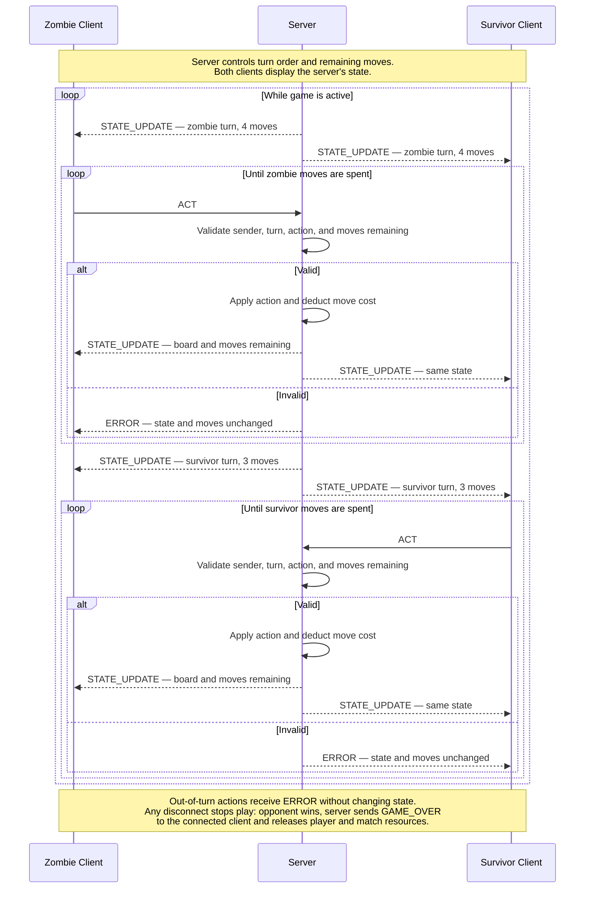

```mermaid
sequenceDiagram
    participant Z as Zombie Client
    participant S as Server
    participant H as Survivor Client

    Note over Z,H: Server controls turn order and remaining moves.<br/>Both clients display the server's state.

    loop While game is active
        S-->>Z: STATE_UPDATE — zombie turn, 4 moves
        S-->>H: STATE_UPDATE — zombie turn, 4 moves

        loop Until zombie moves are spent
            Z->>S: ACT
            S->>S: Validate sender, turn, action, and moves remaining
            alt Valid
                S->>S: Apply action and deduct move cost
                S-->>Z: STATE_UPDATE — board and moves remaining
                S-->>H: STATE_UPDATE — same state
            else Invalid
                S-->>Z: ERROR — state and moves unchanged
            end
        end

        S-->>Z: STATE_UPDATE — survivor turn, 3 moves
        S-->>H: STATE_UPDATE — survivor turn, 3 moves

        loop Until survivor moves are spent
            H->>S: ACT
            S->>S: Validate sender, turn, action, and moves remaining
            alt Valid
                S->>S: Apply action and deduct move cost
                S-->>Z: STATE_UPDATE — board and moves remaining
                S-->>H: STATE_UPDATE — same state
            else Invalid
                S-->>H: ERROR — state and moves unchanged
            end
        end
    end

    Note over Z,H: Out-of-turn actions receive ERROR without changing state.<br/>Any disconnect stops play: opponent wins, server sends GAME_OVER<br/>to the connected client and releases player and match resources.
```
